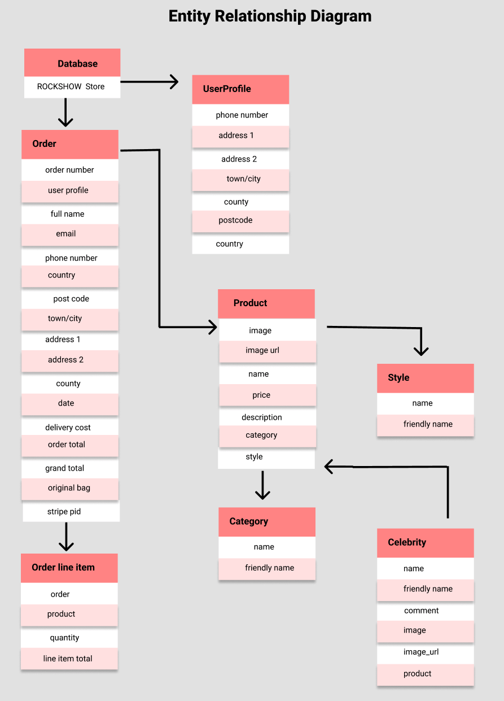

# The ROCKShow Store

## The ROCKShow is a fictional online musical instruments store. The stores purpose is to sell different types of instruments, such as Guitar, Drums, Bass, and Keyboard. The store will allow the owner to make more sales by moving to an online platform. 

#### The live website can be viewed [here](http://milestone4-rockstore.herokuapp.com)

<br>

## Table Of Contents 

- <a href="#ux">UX</a>
  - <a href="#user-stories">User Stories</a>
  - <a href="#strategy">Strategy</a>
  - <a href="#scope">Scope</a>
  - <a href="#structure">Structure</a>
- <a href="#database">Database</a>
- <a href="#wireframes">Wireframes</a>
- <a href="#surface">Surface</a>
- <a href="#crud">CRUD</a>
- <a href="#features">Features</a>
- <a href="#languages">Languages</a>
- <a href="#testing">Testing</a>
- <a href="#deployment">Deployment</a>
- <a href="#credits">Credits</a>

<br>

<span id="ux"></span>

## UX 

<span id="user-stories"></span>

### User Stories 

**As a New User**

* I want to be able to use the site intuitively. 
* I want to be able to search for products.
* I want to be able to view the details of individual products.
* I want to be able to view famous artists and/or musicians talking about the products.
* I want to be able to order products by category.
* I want to be able to order products by finer details such as A-Z, price low to high or vice versa. 
* I want to be able to add products to my basket and checkout, without an account.
* I want to be shown messages throughout my journey through the site.
* I want to be able to register an account.

**As a Site Owner/Super User**

* I want to have a payment system implemented.
* I want to be able to edit product details.
* I want to be able to add new products.
* I want to encourage returning users by having an easy to use site.

**As a Returning User/Signed In User**

* I want to be able to edit my delivery address and information.
* I want to have a customized profile that shows any previous orders.
* I want to be able to log in to a previously registered profile. 

**Key Benefits Of Having An Account**
* As a registered user, you have a profile. Here you can view previous orders and save default delivery information. A non registered user does not have a profile.

<span id="strategy"></span>

### 1.Strategy 

**Project Goals**

* To make a full-stack site based around business logic used to control a centrally-owned database.
* To make a full-stack site that uses HTML, CSS, JavaScript, Python + Django.
* Creating a website that uses a relational database.
* Creating a website that uses Stripe payments.

**Site Owner Goals(Business Goals)**

* Creating a secure, professional and profitable e-commerce website.
* Inspire users to play music and initialize a new hobby.

<span id="scope"></span>

### 2.Scope

* Fits in with my current skill-set of HTML, CSS, JavaScript, Python and Django.

<span id="structure"></span>

### 3.Structure

**As A New User (Not Logged In)**

A new user can visit:
  * The home page
  * Can access the register and login pages 
  * The products page
  * Sign up for newsletter on contact page
  * The basket
  * The checkout

**As A Registered User (Logged In)** 
A returning user can visit:
  * The home page
  * Can access the log out functionality
  * Profile, to save details and view previous orders.
  * Leave a review function
  * The products page
  * Sign up for newsletter on contact page
  * Specific category pages
  * The basket
  * The checkout

**As Superuser (Site Owner)**
A superuser can visit:
  * The home page
  * Can access the log out functionality
  * Profile
  * Product management (Add a product)
  * Edit a product
  * Delete a product
  * Send a newsletter to subscribers
  * The products page
  * Specific category pages
  * The basket
  * The checkout

<span id="database"></span>

### Database 

* During the development phase I used the sqlite3 database.
* For deployment, I used the PostgresSQL database which is provided by Heroku.

### Database Models

<br>


**ER Diagram**



**Profile App**

**UserProfile model**

| **Name** | **Database Key** | **Field Type** | **Validation** |
--- | --- | --- | --- 
 User | user | OneToOneField |  User, on_delete=models.CASCADE
 Phone number | default_phone_number | CharField | max_length=20, null=True, blank=True
 Street address 1 | default_street_address1 | CharField | max_length=80, null=True, blank=True
 Street address 2 | default_street_address2 | CharField | max_length=80, null=True, blank=True
 Town/City | default_town_or_city | CharField | max_length=40, null=True, blank=True
 Postcode | default_postcode | CharField | max_length=20, null=True, blank=True
 Country | default_country | CountryField | blank_label='Country', null=True, blank=True

**Checkout App**

**Order model**

| **Name** | **Database Key** | **Field Type** | **Validation** |
--- | --- | --- | --- 
 Order number | order_number | CharField | max_length=32, null=False, editable=False
 User profile | user_profile | ForeignKey | UserProfile, on_delete=models.SET_NULL, null=True, blank=True, related_name='orders'
 Full name | full_name | CharField | max_length=50, null=False, blank=False
 Email| email| EmailField | max_length=254, null=False, blank=False
 Phone number | phone_number | CharField | max_length=20, null=False, blank=False
 Country| country | CountryField | blank_label='Country *', null=False, blank=False
 Postcode | postcode | CharField | max_length=20, null=True, blank=True
 Town/City | town_or_city | CharField | max_length=40, null=False, blank=False
 Street address 1 | street_address1 | CharField | max_length=80, null=False, blank=False
 Street address 2 | street_address2 | CharField | max_length=80, null=True, blank=True
 County | county | CharField | max_length=80, null=True, blank=True
 Date | date | DateTimeField | auto_now_add=True
 Delivery cost | delivery_cost | DecimalField | max_digits=6, decimal_places=2, null=False, default=0
 Order total | order_total | DecimalField | max_digits=10, decimal_places=2, null=False, default=0
 Grand total | grand_total | DecimalField | max_digits=10, decimal_places=2, null=False, default=0
 Original bag | original_bag | TextField | null=False, blank=False, default=''
 Stipe pid | stripe_pid | CharField | max_length=254, null=False, blank=False, default=''

**OrderLineItem model**

| **Name** | **Database Key** | **Field Type** | **Validation** |
--- | --- | --- | --- 
 Order  | order | ForeignKey | Order, null=False, blank=False, on_delete=models.CASCADE, related_name='lineitems'
 Product | product | ForeignKey | Product, null=False, blank=False, on_delete=models.CASCADE
 Quantity | quantity | IntegerField | null=False, blank=False, default=0
 Lineitem total | lineitem_total | DecimalField | max_digits=6, decimal_places=2, null=False, blank=False, editable=False

**Products App**

**Category model**

| **Name** | **Database Key** | **Field Type** | **Validation** |
--- | --- | --- | --- 
 name | name | CharField | max_length=254
 Friendly name | friendly_name | CharField | max_length=254, null=True, blank=True

 **Style model**

| **Name** | **Database Key** | **Field Type** | **Validation** |
--- | --- | --- | --- 
 name | name | CharField | max_length=50
 Friendly name | friendly_name | CharField | max_length=50, null=True, blank=True

 **Celebrity model**

| **Name** | **Database Key** | **Field Type** | **Validation** |
--- | --- | --- | --- 
 name | name | CharField | max_length=50
 comment | comment | CharField | max_length=500
 Image | image | ImageField | null=True, blank=True
 Image url | image_url | URLField | max_length=1024, null=True, blank=True
 Product | product | ForeignKey | Product, null=False, blank=False, on_delete=models.CASCADE
 Friendly name | friendly_name | CharField | max_length=50, null=True, blank=True

**Product model**

| **Name** | **Database Key** | **Field Type** | **Validation** |
--- | --- | --- | --- 
 Category| category| ForeignKey | Category, null=True, blank=True, on_delete=models.SET_NULL
 Sku | sku | CharField | max_length=254 | null=True, blank=True
 Name | name | CharField | max_length=254
 Description | description | TextField | null=True, blank=True
 Price | price | DecimalField | max_digits=6, decimal_places=2
 Rating | rating | DecimalField | max_digits=6, decimal_places=2
 Image url | image_url | URLField | max_length=1024, null=True, blank=True
 Image | image | ImageField | null=True, blank=True
 Style | style| ForeignKey | Style, null=True, blank=True, on_delete=models.SET_NULL


<span id="wireframes"></span>


### 4.Wireframes

 **Home page wireframe can be viewed [here](./media/wireframe_desktop_home.png)**
 
 **Products page wireframe can be viewed [here](./media/wireframe_desktop_products_list.png)**
 
 **Shopping Bag page wireframe can be viewed [here](./media/wireframe_desktop_shopping_bag.png)**

 **Checkout page wireframe can be viewed [here](./media/wireframe_desktop_checkout.png)**

<span id="surface"></span>

### 5.Surface

**Colours**

* I kept the colours of the site, consistent and subtle. The colours flow together nicely and allow easy use of the site without overwhelming the user. The colours hold neutral connotations - black and white with some details in dark red for purposely highlight specifics elements like buttons, icons, and inputs.

 - Dark Red: rgb(75, 1, 1);

 - Black: #222;

 - White: white;


**Font**

* I used Lato for the whole application, for brand name or text that required attention I've changed the font weight, style and element(following SEO principals). I used Google Fonts to choose this pairing. It feels modern together and are not difficult to read on any screen size. 

**Images**

* All the musical instruments images applied in the application were imported from the real Music Shop, that is possible to check it [here](https://www.thomann.de/gb/index.html)

<br>

## Features 

<span id="crud"></span>

### CRUD 

**Create** 

* Create functionality is provided for the superuser via product management. A site owner (superuser) can add a new product using a front-end form that will add the product to the database and visually to the front end.
* Create functionality is provided for logged in / registered users as they can add reviews to products.

<br>

**Read** 

* All users can read the information within the site.

<br>

**Update**

* Update functionality is provided for the superuser via the product page, using the "edit" button. Here the site owner can edit the products information on the site and database. 

<br>

**Delete**

* Delete functionality is provided to the superuser via the product page, using the "delete" button. Here the site owner can delete a product from the site and database.

<br>

<span id="features"></span>

### Current Features 

* Product page features a "filter by" option allowing users to choose how they see products.
* Categories dropdown from Navbar, allowing the user to access specific categories.
* Product detail page showing details.
* Comments from celebrities and/or famous musicians.
* A contact page that provides feedback to the user after the form is submitted.
* A newsletter sign up. 
* A functional checkout process that requires a user to complete a valid form.
* Stripe payments, with and without card authentication. (Test card numbers can be used to prompt an authentication request.)
* Toast messages throughout user journey.
* Confirmation emails of orders.


### Future Features

* Change newsletter to an API such as mailchimp, to send automated monthly or weekly updates.
* Social media login / registration.
* A wishlist or favorites option, where users can save items to their profile.
* A loyalty programme where users receive free shipping after so many orders or build up points. 
* Contact emails are sent to a "business" email address.
* Option to add reviews to products as a logged in user.
* A newsletter sign up.
* Superuser ability to send newsletters to subscribers.

<br>

<span id="languages"></span>

## Languages Used 

* [HTML5](https://en.wikipedia.org/wiki/HTML5) 
  -  Used for basic content structure.
* [CSS3](https://en.wikipedia.org/wiki/CSS) 
  - Used for styling content.
* [Python](https://www.python.org/) 
  - Used to implement backend development. 
* [JavaScript](https://en.wikipedia.org/wiki/JavaScript)
  - Used to initialize interactive features.

## Frameworks, Libaries & Other Tools Used 

* [Django](https://docs.djangoproject.com/en/3.2/)
  - Backend framework for this project.
* [Github](https://github.com/)
  - Used to store the project.
* [Git](https://git-scm.com/)
  - Used for version control.
* [Google Fonts](https://fonts.google.com/)
  - To implement the fonts used.
* [Figma](https://frontify.com/)
  - To design wireframes.
* [Heroku](https://id.heroku.com/)
  - Cloud platform to deploy the project.
* [Font Awesome](https://fontawesome.com/)
  - For any icons within the site.
* [cdnjs](https://cdnjs.com/)
  - To get Font Awesome linked.

<br>

<span id="testing"></span>

<!-- ## Testing  -->

<span id="deployment"></span>

## Deployment 

### To Clone 

* The project can be run locally by cloning.
* Open the repository and click "Code", then select "clone".
* When you choose to clone you will be provided with a URL. Copy the URL from the "Clone with HTTPS" section.
* In your IDE, open Git Bash.
* Type Git Clone and then paste the URL you copied.
* Press enter and this will create the clone.

**Requirements**
* Python3
* GitHub account
* Heroku account
* Gitpod or an IDE of your choice
* Stripe account
* AWS Amazon account
* Gmail account

### Work With The Local Copy

* Ensure you have all of the above requirements set up.
* Go to the workspace of your local copy. In the CLI type: <code>pip3 install -r requirements.txt</code>
* Set up the environment variables: 
    - Create a `.gitignore` file in the root directory of the project. 
    - Create a `.env.py` file. To this add the following environmental variables.

    ```
    Import os
    os.environ("SECRET_KEY_MS4", "Added by developer")
    os.environ("STRIPE_PUBLIC_KEY", "Added by developer")
    os.environ("STRIPE_SECRET_KEY", "Added by developer")
    os.environ("STRIPE_WH_SECRET", "Added by developer")
    os.environ("DATABASE_URL", "Added by developer")
    ```
    - As an alternative to storing these environmental variables in env.py, if you are working with Gitpod these can be stored in account settings accessed by visiting your workspaces. Click the profile icon, add the variables here and then correctly reference these within settings.
* Add the env.py file to gitignore.
* Next perform migrations to create the database. Do this by running the command <code>python3 manage.py makemigrations</code> followed by <code>python3 manage.py migrate</code>
* Create a superuser to have access to the admin panel. <code>python3 manage.py createsuperuser</code>
* Now run the app locally using <code>python3 manage.py runserver</code>

### Heroku Deployment 

* To deploy to Heroku, log in or sign up and create a new app.
* Complete the information regarding location and app name.
* Once this is done, go to resources and search for postgres and add this to your app.
* In your CLI install dj_database_url and psycopg2 so that you can use Postgres on your deployed site, install these using the following 
  <code>pip3 install dj_database_url
  pip3 install psycopg2</code>
* Log in using the CLI <code>heroku login -i</code>
* Migrate the database to postgres using <code>heroku run python manage.py migrate</code>
* Install gunicorn using <code>pip3 install gunicorn</code>
* Create a file called Procfile and ensure this is in it: 
```
web: gunicorn name_of_application.wsgi:application
```
* In settings set allowed hosts using 
```
 ALLOWED_HOSTS = ['app-name.herokuapp.com', 'localhost']
```
* In Heroku, select the deploy tab and under deployment method choose GitHub
* In connect to GitHub enter your GitHub repository details and when you see the correct one click connect.
* Go to the Settings tab and under Config Vars choose Reveal Config Vars, then enter the following config vars:


    | KEY            | VALUE         |
    |----------------|---------------|
    | AWS_ACCESS_KEY_ID | `<aws access key>`  |
    | AWS_SECRET_ACCESS_KEY | `<aws secret access key>`  |
    | DATABASE_URL| `<postgres database url>`  |
    | EMAIL_HOST_PASS | `<email password(generated by Gmail)>` |
    | EMAIL_HOST_USER| `<email address>`  |
    | SECRET_KEY_MS4 | `<your secret key>`  |
    | STRIPE_PUBLIC_KEY| `<your stripe public key>`  |
    | STRIPE_SECRET_KEY| `<your stripe secret key>`  |
    | STRIPE_WH_SECRET| `<your stripe wh key>`  |
    | USE_AWS | `True`  |

* Set up Database
    - Copy the **DATABASE_URL** (Postgres URL) from the config variables of Heroku and paste it into the default database in `settings.py`.

    DATABASES = {
        'default': dj_database_url.parse("<DATABASE_URL here>")
    }

  This setup for the databases is only temporary while deploying to Heroku.
  - Migrate the models to create the database by the following commands:
        - `python3 manage.py makemigrations`
        - `python3 manage.py migrate`
  - Load the data fixtures for categories and product in this exact order:
      - `python3 manage.py loaddata categories`
      - `python3 manage.py loaddata products`
  - Create a superuser. The superuser will have access to the admin page.
    - `python3 manage.py createsuperuser`
    - Enter your username, email and password.
    - Remove the DATABASE_URL from `settings.py` and set the previous default DATABASE settings.
    - Push the code to Github.

#### Static & Media Files
* To host static and media files you will need an AWS S3 Bucket. 
  - You will need to create an account and create an S3 bucket. From here set up a group, a policy and user in the IAM environment. 
  - For further detail on these parameters and a deeper explanation you can find out more [here](https://aws.amazon.com/s3/).

<br>

<span id="credits"></span>

# Credits

## Code

- This whole application was based on the Code Institute project Boutique Ado, and I used the base code as a template and main structure for my application. I made the necessary
adjustments both the code(strucutre) and database to achieve the expected result.
    - [Code Institute Reference](https://github.com/ckz8780/boutique_ado_v1)<br/>
    Author: [Chris Z.](https://github.com/ckz8780)

- The following repositories were used as references to this project as well:
    - [Elly](https://github.com/EllyC20/The-BookStore-MS4)<br/>
    Author: [Elly](https://github.com/EllyC20)


    - [GrowApps TM](http://ms3-project-ci.herokuapp.com/home)<br/>
    Author: [Goran Kuzma](https://github.com/kuzGo)


    - [Read It](http://ms3-project-ci.herokuapp.com/home)<br/>
    Author: [Taylor Brookes](https://github.com/taybro23)

- For technical support I used the Slack software, connecting with many [Code Institute's](https://codeinstitute.net/) students, and also the following platforms and Video Tutorials:

    - [W3C School](https://www.w3schools.com/), official documentation.
    
    - [Flask Tutorial](https://www.youtube.com/watch?v=mqhxxeeTbu0&list=PLzMcBGfZo4-n4vJJybUVV3Un_NFS5EOgX)<br/>
        Author: [Tech with Tim](https://www.youtube.com/channel/UC4JX40jDee_tINbkjycV4Sg)
    
    - [Django for Beginners Tutorial](https://www.youtube.com/watch?v=sm1mokevMWk) <br/>
        Author: [Tech with Tim](https://www.youtube.com/channel/UC4JX40jDee_tINbkjycV4Sg)

    - [Learn Python Tutorial](https://www.youtube.com/watch?v=rfscVS0vtbw&t=1s)<br/>
        Author: [freeCodeCamp](https://www.youtube.com/channel/UC8butISFwT-Wl7EV0hUK0BQ)

    - [Learn AWS Tutorial](https://www.youtube.com/watch?v=g2JOHLHh4rI)<br/>
        Author: [freeCodeCamp](https://www.youtube.com/channel/UC8butISFwT-Wl7EV0hUK0BQ)

## README.md
For the README.md file I used as model the [Code Institute](https://codeinstitute.net/) repository, such as the other students project's repositories as well (mentioned above), including my owns READMEs files from previous projects:

- [Code Institute Repository](https://github.com/Code-Institute-Solutions/SampleREADME)<br/>
    Author:[Matt Rudge](https://github.com/lechien73)

- [GitHub MarkDown Documentation](https://docs.github.com/en/github/writing-on-github/getting-started-with-writing-and-formatting-on-github/basic-writing-and-formatting-syntax)


## Images

Beneath you can find the links for the images used in the home.html page:
- [Guitar 1](https://www.thomann.de/gb/harley_benton_sc_450plus_cb_vintage_series.htm)
- [Guitar 2](https://www.thomann.de/gb/epiphone_les_paul_custom_ebony.htm)
- [Guitar 3](https://www.thomann.de/gb/harley_benton_ex_84_modern_benton_blue.htm)
- [Guitar 4](https://www.thomann.de/gb/jackson_kvx_mg7_king_v_x_series_sbk.htm)

- [Bass 1](https://www.thomann.de/nl/harley_benton_hbb1975_na.htm)
- [Bass 2](https://www.thomann.de/nl/marcus_miller_v7_alder_4_awh_2nd_gen.htm)
- [Bass 3](https://www.thomann.de/nl/hoefner_ignition_cavern_se.htm)
- [Bass 4](https://www.thomann.de/nl/fender_sq_aff._jaguar_bass_mn_h_lpb.htm)

- [Keyboard 1](https://www.thomann.de/nl/thomann_sp_5600.htm)
- [Keyboard 2](https://www.thomann.de/nl/marcus_miller_v7_alder_4_awh_2nd_gen.htm)
- [Keyboard 3](https://www.thomann.de/nl/viscount_physis_piano_k5_ex.htm)
- [Keyboard 4](https://www.thomann.de/nl/fender_sq_aff._jaguar_bass_mn_h_lpb.htm)

- [Drums 1](https://www.thomann.de/nl/pearl_decade_maple_6pc_satin_gold.htm)
- [Drums 2](https://www.thomann.de/nl/tama_superstar_classic_kit_22_pclp.htm)
- [Drums 3](https://www.thomann.de/nl/tama_star_drum_bubinga_white_ebony.htm)
- [Drums 4](https://www.thomann.de/nl/tama_club_jam_vintage_kit_cmw.htm)

The images used by the users were not inspected by the Admin.

### Bugs
#### Heroku, Git, Peer Review ,and Typo issues:

-  I received support from the Software Engineer and my personal friend [Robson Silva](https://www.linkedin.com/in/rsilvanet/).
-  I received support from the Software Engineer and my personal friend [Ricardo Schiavetti](https://www.linkedin.com/in/ricardoschiavetti/).

## Acknowledgements

-	I would like to thank my mentor, Jack Wachira, for his guidance, feedback, and great advices. 
-	The slack community for helping me with my coding queries.
-	My personal friends that are always supporting me on this journey. 
-	The Colleagues that helped with the 'Pure Review' and 'Refactoring'. 


[Back to contents](#table-of-contents)